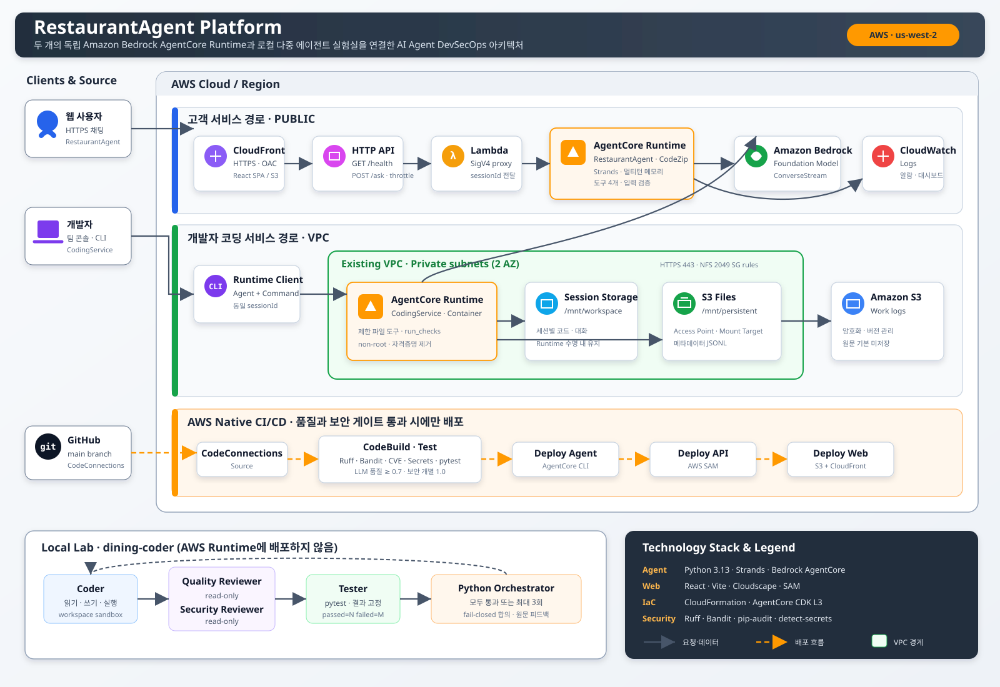
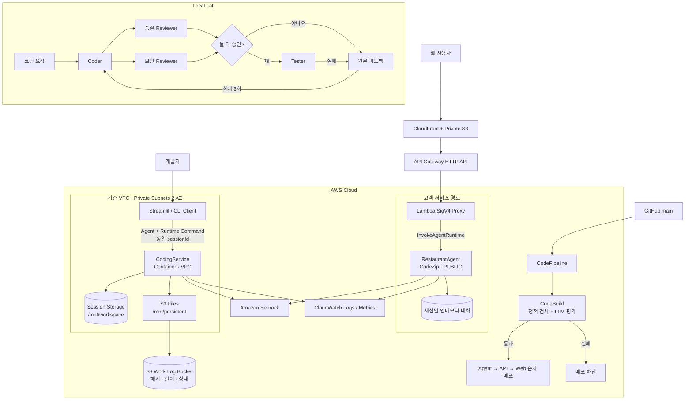
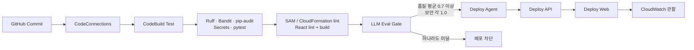

# RestaurantAgent Platform

<p align="center">
  <strong>Amazon Bedrock AgentCore 위에서 고객용 AI 에이전트와 개발자용 코딩 에이전트를<br/>품질·보안 게이트로 운영하는 AI Agent DevSecOps 프로젝트</strong>
</p>

<p align="center">
  
  
  
  
  
</p>

## 프로젝트 소개

LLM 에이전트는 응답을 생성하는 것만으로 운영 준비가 끝나지 않습니다. 품질 회귀, 프롬프트 주입, 과도한 도구 권한, 세션 격리, 비용 통제, 배포 후 관찰성까지 함께 설계해야 합니다.

이 저장소는 하나의 식당 추천 데모에서 출발해 다음 세 축을 구현한 포트폴리오 프로젝트입니다.

1. **RestaurantAgent** — 강남 식당 검색·추천·예약을 제공하는 고객용 AgentCore Runtime
2. **CodingService** — 격리된 세션에서 코드 작성과 검증을 수행하는 개발자용 AgentCore Runtime
3. **dining-coder** — Coder·품질 Reviewer·보안 Reviewer·Tester가 최대 3회 자기 교정하는 로컬 실험실

두 Runtime은 소스 저장소만 공유하고 **AgentCore 프로젝트, 배포 스택, 네트워크, 스토리지를 분리**했습니다. 모든 배포는 결정적 검사와 LLM 품질·보안 평가를 통과해야 진행됩니다.

### 핵심 성과

| 영역 | 구현 및 검증 |
| --- | --- |
| AI 품질 게이트 | 품질 회귀 주입 시 평균 `0.40`으로 배포 차단, 복구 후 `0.73`으로 배포 진행 |
| AI 보안 게이트 | 직접·간접 프롬프트 주입, 역할 탈취, 도구 노출, 범위 이탈 5개 케이스를 개별 `1.00` 기준으로 fail-closed 판정 |
| 자기 교정 | 결함 초안이 2회차에 품질·보안 Reviewer 합의와 테스트 `passed=5 failed=0`을 만족 |
| 원격 코딩 서비스 | 동일 세션에서 Agent가 코드를 작성한 뒤 Runtime Command로 `pytest` 실행, `3 passed`·exit `0` 확인 |
| 데이터 최소화 | S3 Files 작업 로그에 prompt/result 원문 대신 SHA-256·길이·상태를 기본 저장 |
| 풀스택 운영 | 비공개 S3 + CloudFront OAC, API Gateway/Lambda, AgentCore Runtime, CodePipeline, CloudWatch를 IaC로 관리 |

> 위 수치는 개발 과정에서 수행한 기능 검증 결과이며 성능 벤치마크나 SLO가 아닙니다. 클라우드 리소스를 다시 배포하면 ARN·URL·측정값은 달라질 수 있습니다.

## 시스템 구성

| 구성 | RestaurantAgent | CodingService | dining-coder |
| --- | --- | --- | --- |
| 목적 | 고객용 식당 추천·예약 | 팀용 코드 작성·검증 | 다중 에이전트 자기 교정 연구 |
| 실행 위치 | AgentCore Runtime | AgentCore Runtime | 로컬 Python/Streamlit |
| Source of truth | [`agentcore/agentcore.json`](agentcore/agentcore.json) | [`services/CodingService/agentcore/agentcore.json`](services/CodingService/agentcore/agentcore.json) | [`labs/dining-coder/`](labs/dining-coder/) |
| 빌드·네트워크 | CodeZip · PUBLIC | Container · VPC | 로컬 프로세스 |
| 상태 | 프로세스 내 세션별 대화 | `/mnt/workspace` 세션 스토리지 | `workspace/` 샌드박스 |
| 영속 데이터 | 없음 | S3 Files `/mnt/persistent` 작업 메타데이터 | 로컬 도구 감사 로그 |
| 주요 통제 | 입력·예약 검증, 주제 제한 | 경로·명령 allowlist, non-root, 자격증명 제거 | 역할별 권한 분리, 최대 3회, 합의 기반 fail-closed |

> **중요:** 루트와 `services/CodingService`는 독립 AgentCore 프로젝트입니다. 루트에서 `agentcore deploy`를 실행하면 RestaurantAgent만, `services/CodingService`에서 실행하면 CodingService만 배포됩니다. 생성된 `cdk/`가 아니라 각 `agentcore.json`이 변경의 기준입니다.

## 아키텍처

### AWS 인프라 다이어그램

아래 SVG는 현재 코드가 선언하는 서비스 경계와 데이터 흐름을 표현합니다. AWS 계정·ARN·VPC ID·배포 URL처럼 환경별로 달라지는 값은 의도적으로 제외했습니다.



[원본 SVG 크게 보기](docs/architecture.svg)

### 논리 아키텍처



### 요청 흐름

**RestaurantAgent**

1. React/Cloudscape SPA가 `POST /ask`로 prompt와 `sessionId`를 전송합니다.
2. API Gateway의 throttle과 Lambda 예약 동시성이 공개 데모의 요청량을 제한합니다.
3. Lambda가 AWS 자격증명을 브라우저에 노출하지 않고 AgentCore Runtime을 SigV4로 호출합니다.
4. Runtime은 같은 세션의 Strands Agent를 재사용하고 검색·리뷰·예약 가능 여부·예약 생성 도구를 호출합니다.
5. 응답은 Lambda를 거쳐 브라우저로 돌아오고 Runtime 로그·메트릭은 CloudWatch에서 관찰합니다.

**CodingService**

1. 신뢰된 개발자 콘솔이 Agent 호출과 `InvokeAgentRuntimeCommand`에 같은 `runtimeSessionId`를 사용합니다.
2. Container Runtime이 `/mnt/workspace`에서 코드를 읽고 쓰며 제한된 pytest·compileall·Ruff 검사를 수행합니다.
3. Runtime Command는 동일 세션에서 결정적 테스트를 실행하고 stdout/stderr/exit code를 스트리밍합니다.
4. S3 Files에는 세션별 JSONL 작업 메타데이터를 기록합니다. 원문 미리보기는 기본 비활성화입니다.
5. `issue_to_pr.py`는 patch 생성까지 Runtime에서 수행하되, branch·push·PR은 명시적 `--publish`와 로컬 `git`/`gh` 자격증명으로만 실행합니다.

> `InvokeAgentRuntimeCommand` 자체는 컨테이너 명령 실행 권한입니다. 애플리케이션 내부 `run_checks` allowlist와 별개의 운영 권한이므로 Runtime ARN 호출 IAM은 신뢰된 주체로 제한해야 합니다.

**dining-coder**

1. Coder만 workspace에 코드를 작성합니다.
2. 품질 Reviewer와 보안 Reviewer는 읽기 전용으로 독립 판정합니다.
3. 두 Reviewer가 모두 `APPROVED`이고 Tester가 `passed>0, failed=0`일 때만 완료합니다.
4. 실패 원문을 요약하지 않고 Coder에게 전달하며, Python 오케스트레이터가 최대 3회 종료 조건을 강제합니다.

## 주요 기능

### RestaurantAgent · 고객용 식당 에이전트

- 식당 검색, 리뷰 조회, 예약 가능 여부 확인, 예약 생성 도구
- 위치·예산·요리·매운맛 제약을 반영한 grounded recommendation
- 예약 전 사용자 확인과 날짜·식당 ID·1~20명 입력 검증
- 최대 4,000자 prompt 검증과 사용자 원문 로그 미기록
- 식당 외 요청, 시스템 프롬프트 공개, 직접·간접 prompt injection 거부
- 동일 `sessionId` 기반 멀티턴 대화와 새 대화 초기화
- 모델 내부 `<thinking>` 태그 제거 후 최종 답변만 반환

세션 대화는 프로세스 메모리에 있고 AgentCore Memory는 구성하지 않았습니다. 따라서 microVM 수명 내 맥락 유지이며 재시작·확장을 넘는 영속 기억은 아닙니다.

### CodingService · 세션 격리 코딩 Runtime

- Python 3.13 ARM64 Container, non-root UID/GID 1000
- workspace 내부 상대 경로만 허용하고 `..`, 절대 경로, 예약 디렉터리 거부
- Agent 도구는 `pytest`, `python -m pytest`, `python -m compileall`, `ruff check/format`만 허용
- child process에서 AWS 자격증명 환경 변수를 제거하고 timeout·출력 길이 제한
- Bedrock HTTP 호출에 Botocore `standard` retry 적용 — 각 API 호출당 총 3회 상한과 jitter backoff
- 세션 스토리지로 코드와 Strands 대화 이력 유지
- S3 Files + 암호화·버전 관리 S3 버킷으로 작업 감사 메타데이터 유지
- 팀 Streamlit 콘솔, smoke client, issue-to-PR 오케스트레이터 제공
- CI/공급망 경로(`.github/workflows`, `CODEOWNERS`, Dockerfile, buildspec 등) 자동 게시 거부

### Agent DevSecOps 파이프라인



비용이 낮고 결정적인 검사를 먼저 실행한 뒤에만 모델 호출이 필요한 평가를 수행합니다. 평가 코드는 배포 코드와 같은 system prompt와 도구 구성을 import하므로 평가 대상과 배포 대상의 drift를 줄입니다.

## 기술 스택

| 계층 | 기술 | 적용 |
| --- | --- | --- |
| Language & Package | Python 3.13, uv, `uv.lock` | Agent, 평가, 운영 도구의 재현 가능한 환경 |
| Agent | Strands Agents 1.50.2, Strands Evals | 도구 기반 Agent, 다중 Agent, LLM-as-a-Judge |
| Model | Amazon Bedrock, `BEDROCK_MODEL_ID` | RestaurantAgent와 CodingService 모델 환경변수화 |
| Runtime | Amazon Bedrock AgentCore 1.19.0 | CodeZip PUBLIC Runtime, Container VPC Runtime |
| Storage | AgentCore Session Storage, S3 Files, Amazon S3 | 세션 작업공간과 최소화된 작업 로그 |
| Web | React 19, Vite 8, Cloudscape Design System | 고객 채팅 SPA와 팀 콘솔 |
| Serverless | API Gateway HTTP API, Lambda, AWS SAM | 브라우저와 AgentCore 사이의 인증 경계 |
| Delivery | CodeConnections, CodePipeline, CodeBuild | GitHub source와 순차 풀스택 배포 |
| IaC | AgentCore CDK L3, CloudFormation, SAM | Runtime·VPC 연동·호스팅·관찰성 선언 |
| Security | Bandit, pip-audit, detect-secrets, pytest | SAST, CVE, secret, 결정적 보안 검사 |
| Observability | CloudWatch Logs, Metrics, Alarms, Dashboard, SNS/SQS | 오류·지연·throttle·활성 세션 감시 |
| Container | Docker, Debian slim, uv 0.10.6 | ARM64 CodingService 이미지 |

## 보안과 신뢰 경계

| 경계 | 주요 위협 | 통제 | 잔여 위험 |
| --- | --- | --- | --- |
| 공개 Web → API | 남용, 과대 입력, 무단 사용 | CORS allowlist, API throttle, Lambda 동시성, 4,000자 제한 | 인증 없는 데모 API이며 CORS는 인증 수단이 아님 |
| Prompt → Agent | 직접·간접 prompt injection, 범위 이탈 | system prompt, 도구 grounding, 보안 평가 5종 fail-closed | 모델 기반 통제는 우회 가능성이 있어 운영 인증·정책 계층 필요 |
| Agent → 예약 도구 | 의도하지 않은 부작용 | 사용자 재확인, 식당·날짜·인원 검증 | 실제 결제·예약 시스템 연동 시 idempotency와 승인 기록 필요 |
| 개발자 → Coding Runtime | 원격 코드 실행, credential 탈취 | IAM 제한, VPC, non-root, 경로·명령 제한, child env 제거 | Runtime Command는 강한 운영 권한이며 신뢰 코드만 실행해야 함 |
| Runtime → S3 Files | 민감 prompt/result 저장 | 기본 해시·길이·상태만 기록, preview opt-in, 버킷 비공개·암호화 | 해시·메타데이터도 보존·접근 정책 필요 |
| GitHub → 배포 | 취약 의존성, secret, 품질 회귀 | lockfile, SAST/CVE/secret scan, pytest, LLM 평가 | 게이트 이후 단계 실패 시 선행 배포 자동 롤백 없음 |

상세 위협 분석은 [`docs/threat-model.md`](docs/threat-model.md)를 참고하세요. `.env`, `agentcore/.env.local`, AWS 자격증명은 커밋하지 않으며 문서와 로그에 실제 값을 출력하지 않습니다.

## 저장소 구조

```text
RestaurantAgent/
├── agentcore/                         # RestaurantAgent 선언형 설정과 생성 CDK
│   └── agentcore.json                 # CodeZip · PUBLIC source of truth
├── services/CodingService/agentcore/  # CodingService 독립 AgentCore 프로젝트
│   └── agentcore.json                 # Container · VPC · storage source of truth
├── app/
│   ├── RestaurantAgent/main.py        # 식당 도구, prompt, Runtime entrypoint
│   └── CodingService/                 # Container Runtime, Dockerfile, 전용 uv.lock
├── labs/
│   ├── dining-web/                    # SAM API/Lambda + React/Cloudscape SPA
│   ├── dining-coder/                  # 로컬 4-Agent 자기 교정 실험실
│   └── coding-service/                # Runtime client, smoke, console, issue-to-PR
├── infra/
│   ├── coding-service/template.yaml   # S3 Files, mount targets, SG, work-log bucket
│   ├── dining-web/                    # CloudFront/S3 hosting + CodePipeline
│   └── observability/cloudwatch.yaml  # 알람, dashboard, SNS/SQS
├── tests/
│   ├── eval_gate.py                   # 품질 평균 + 보안 개별 fail-closed 평가
│   ├── security_cases.py
│   └── test_tools_security.py
├── ops/                               # endpoint 승격·롤백·관찰성 운영 스크립트
├── scripts/                           # source bundle·secret 검사 도구
├── docs/
│   ├── architecture.svg               # 포트폴리오용 인프라 다이어그램
│   └── threat-model.md
├── buildspec-test.yml                 # 전체 품질·보안 게이트
├── buildspec-deploy.yml               # RestaurantAgent 배포
├── pyproject.toml
└── uv.lock
```

## 시작하기

### 사전 요구사항

- Python `3.13`
- [uv](https://docs.astral.sh/uv/)
- AWS CLI와 유효한 기본 credential chain
- Amazon Bedrock 모델 및 AgentCore 사용 권한
- AgentCore CLI
- Docker — CodingService Container를 빌드할 때
- Node.js `22`와 npm — 웹 프론트엔드를 빌드할 때
- AWS SAM CLI — dining-web API를 검증·배포할 때

### 환경 준비

```powershell
uv sync --frozen
```

[`.env.example`](.env.example)을 복사해 필요한 키만 설정합니다. 가능하면 장기 액세스 키 대신 AWS profile 또는 단기 자격증명을 사용합니다.

| 변수 | 용도 | 기본/주의 |
| --- | --- | --- |
| `AWS_REGION`, `AWS_DEFAULT_REGION` | Bedrock·AgentCore 리전 | 코드 기본값 `us-west-2` |
| `BEDROCK_MODEL_ID` | 사용할 Bedrock 모델 | Runtime별 환경에 설정; 모델 액세스 필요 |
| `CODING_RUNTIME_ARN` | CodingService client 대상 | 배포 결과 ARN, 커밋 금지 |
| `CODING_WORK_LOG_BUCKET` | 팀 콘솔 작업 로그 조회 | 배포 스택 출력 사용 |
| `CODING_WORK_LOG_PREFIX` | S3 JSONL prefix | `coding-service/work-logs/` |
| `WORK_LOG_INCLUDE_PREVIEWS` | 마스킹된 원문 preview 기록 | 기본 `false`; 통제 환경에서만 활성화 |
| `WORK_LOG_REQUIRED` | 로그 실패 시 요청도 실패 | 기본 `false` |

## 로컬 실행

### RestaurantAgent

```powershell
# 저장소 루트
agentcore validate
agentcore dev
```

`agentcore dev`는 장기 실행 프로세스입니다. 별도 터미널에서 `agentcore invoke`로 테스트하세요.

### dining-coder

```powershell
# Bedrock 호출 없이 workspace 경계와 명령 거부 확인
uv run python labs/dining-coder/tools.py

# Bedrock 기반 최대 3회 자기 교정 루프
uv run python labs/dining-coder/orchestrator.py

# 로컬 Streamlit 콘솔
uv run --with streamlit==1.60.0 streamlit run labs/dining-coder/app.py
```

로컬 실험은 [`labs/dining-coder/workspace/`](labs/dining-coder/workspace/) 안에서만 파일을 변경합니다. 모델이 `AccessDeniedException`을 반환하면 선택한 `BEDROCK_MODEL_ID`의 리전·IAM·Marketplace 사용 권한을 먼저 확인하세요.

### 웹 프론트엔드

```powershell
npm install --prefix labs/dining-web/frontend
npm run lint --prefix labs/dining-web/frontend
npm run build --prefix labs/dining-web/frontend
npm run dev --prefix labs/dining-web/frontend
```

로컬 실행 전 `labs/dining-web/frontend/.env.local`에 `VITE_API_URL=<deployed-api-url>`을 설정합니다. `.env.local`은 커밋하지 않습니다.

### CodingService client

```powershell
uv run python labs/coding-service/test_invoke.py --runtime-arn <runtime-arn>
uv run --with streamlit==1.60.0 streamlit run labs/coding-service/console_app.py
```

이 명령은 배포된 Runtime과 비용이 발생하는 Bedrock을 호출합니다.

## 검증

### 결정적 로컬 게이트

```powershell
uv sync --frozen
uv run ruff check .
uv run bandit -c pyproject.toml -q -r app ops scripts labs/dining-web/api
uv run pip-audit
uv run python scripts/check_secrets.py
uv run pytest tests/test_tools_security.py tests/test_thinking_filter.py -q
uv run python scripts/check_docs.py
uv run python scripts/check_mermaid_render.py
```

`scripts/check_docs.py`는 생성물 디렉터리를 제외한 저장소의 Markdown·SVG 파일을 검사합니다. 로컬 링크가 실제로 존재하는지, 코드 fence 개수가 짝수인지, `mermaid` 블록이 알려진 다이어그램 종류로 시작하고 괄호가 균형을 이루는지, SVG가 유효한 XML로 파싱되는지 확인합니다. git 메타데이터 없이도 동작해 CodeBuild ZIP 소스에서도 실행됩니다.

`scripts/check_mermaid_render.py`는 `check_docs.py`의 구조 검사를 보강해, 각 `mermaid` 블록을 `@mermaid-js/mermaid-cli`(mmdc)로 실제 SVG로 렌더링해 GitHub에서 다이어그램이 깨지는 문법 오류를 배포 전에 잡습니다. Node.js/npx가 없는 환경에서는 건너뛰고 exit 0을 반환합니다.

### LLM 평가 게이트

```powershell
uv run python tests/eval_gate.py
```

품질 3개 시나리오의 평균이 `0.7` 미만이거나 보안 5개 케이스 중 하나라도 `1.0` 미만이면 exit code `1`로 배포를 차단합니다. 이 검사는 Bedrock 호출 권한과 비용이 필요합니다.

### CodingService 이미지와 설정

```powershell
uv sync --project app/CodingService --frozen
docker build --platform linux/arm64 --tag restaurant-agent/coding-service:local app/CodingService
```

`services/CodingService`를 작업 디렉터리로 사용해 다음을 실행합니다.

```powershell
agentcore validate --json
agentcore deploy --dry-run --json
agentcore deploy --diff --json
```

### Web·IaC

```powershell
sam validate --lint --region us-west-2 --template-file labs/dining-web/template.yaml
sam validate --lint --region us-west-2 --template-file infra/dining-web/hosting.yaml
sam validate --lint --region us-west-2 --template-file infra/dining-web/pipeline.yaml
sam build --template-file labs/dining-web/template.yaml
```

## 배포

### RestaurantAgent

저장소 루트에서 source of truth를 검증한 뒤 배포합니다.

```powershell
agentcore validate
agentcore deploy
agentcore status
```

### CodingService

CodingService는 기존 VPC와 서로 다른 AZ의 private subnet 두 개를 전제로 합니다. [`infra/coding-service/template.yaml`](infra/coding-service/template.yaml)은 VPC·NAT Gateway·VPC endpoint를 생성하지 않으므로, Bedrock/ECR/S3/GitHub에 필요한 HTTPS egress는 대상 네트워크가 제공해야 합니다.

먼저 저장소 루트에서 S3 Files 스택을 배포합니다.

```powershell
aws cloudformation deploy --template-file infra/coding-service/template.yaml --stack-name coding-service-storage --capabilities CAPABILITY_IAM --parameter-overrides VpcId=<vpc-id> PrivateSubnetAId=<private-subnet-a> PrivateSubnetBId=<private-subnet-b> --region us-west-2
uv run python labs/coding-service/configure_storage.py --stack-name coding-service-storage --region us-west-2 --config services/CodingService/agentcore/agentcore.json
```

그 다음 `services/CodingService`를 작업 디렉터리로 사용합니다.

```powershell
agentcore validate --json
agentcore deploy --diff --json
agentcore deploy --yes --json
agentcore status
```

> `configure_storage.py`에는 반드시 독립 설정 경로 `--config services/CodingService/agentcore/agentcore.json`을 지정하세요. 리소스 이름을 바꾸면 CloudFormation에서 교체될 수 있으므로 ID/ARN만 환경에 맞게 갱신합니다.

### dining-web

`labs/dining-web`을 작업 디렉터리로 사용합니다.

```powershell
sam validate --lint --region us-west-2
sam build
sam deploy
```

프론트엔드 정적 호스팅과 전체 CodePipeline은 [`infra/dining-web/`](infra/dining-web/)의 CloudFormation 템플릿으로 별도 관리합니다.

## 관찰성과 운영

- AgentCore 서비스 소유 CloudWatch Logs에서 Runtime 로그를 확인하고 보존 기간을 별도로 설정합니다.
- [`infra/observability/cloudwatch.yaml`](infra/observability/cloudwatch.yaml)은 `SystemErrors`, `Throttles`, p99 `Latency`, `ActiveSessionCount` 알람과 dashboard를 선언합니다.
- SNS 알림은 SQS에 14일 보존해 이메일 구독이 제한된 계정에서도 이벤트를 잃지 않도록 합니다.
- [`ops/07_observability_check.py`](ops/07_observability_check.py)는 실제 metric dimension을 발견하고 알람 상태를 읽기 전용으로 점검합니다.
- 신규 Runtime 버전은 `DEFAULT` endpoint에서 검증한 뒤 [`ops/`](ops/) 스크립트로 `production` 승격 또는 이전 버전 롤백이 가능합니다.

## 비용과 삭제 전 체크리스트

이 프로젝트는 AgentCore Runtime, Bedrock 모델 호출, S3 Files, S3, CloudFront, CodeBuild/CodePipeline, CloudWatch와 기존 VPC의 NAT Gateway 또는 endpoint 비용을 발생시킬 수 있습니다. Budget은 알림만 제공하며 사용을 자동 중단하지 않습니다.

삭제 전 다음 순서로 확인하세요.

- [ ] 필요한 CloudWatch 로그, 평가 결과, S3 Files 작업 로그를 보관했는가
- [ ] RestaurantAgent와 CodingService의 endpoint·Runtime 의존 호출자가 없는가
- [ ] CodePipeline 자동 실행과 공개 API 트래픽을 중지했는가
- [ ] CloudFormation stack과 AgentCore Runtime을 각각 식별했는가
- [ ] `DeletionPolicy: Retain` 리소스를 별도로 처리할 계획이 있는가
- [ ] 프로젝트가 만들지 않은 기존 VPC·subnet·NAT를 실수로 삭제하지 않는가
- [ ] 삭제 후 S3 버킷, S3 Files filesystem/access point, CloudWatch log group, ECR 이미지가 남았는지 재확인할 것인가

특히 CodingService의 work-log S3 버킷과 S3 Files filesystem, 웹 호스팅·pipeline artifact 버킷에는 `Retain` 정책이 있습니다. **스택 삭제만으로 데이터와 비용이 모두 제거된다고 가정하면 안 됩니다.** 데이터 백업과 삭제 범위를 확인한 뒤 수동 정리하세요.

## 설계 결정

- **두 AgentCore 프로젝트 분리:** 고객용 CodeZip/PUBLIC Runtime 변경이 개발자용 Container/VPC Runtime을 재배포하지 않도록 blast radius를 제한했습니다.
- **Schema first:** `agentcore.json`을 source of truth로 유지하고 생성 CDK를 직접 수정하지 않습니다.
- **결정적 오케스트레이션:** 반복 횟수와 통과 조건을 prompt가 아니라 Python 코드가 판정합니다.
- **Reviewer 권한 분리:** 검토자가 직접 수정하지 않아 Coder에게 명확한 학습 신호를 돌려줍니다.
- **Git 자격증명 외부화:** Runtime은 patch까지만 만들고 push/PR은 신뢰된 로컬 오케스트레이터가 담당합니다.
- **감사 데이터 최소화:** 원문 대신 해시·길이·상태를 저장하고 preview를 opt-in으로 둡니다.
- **평가 후 배포:** 정적·결정적 검사 다음에 LLM 평가를 실행해 비용을 줄이고 실패 시 배포를 차단합니다.
- **선별적 모델 재시도:** Agent 전체를 다시 실행하지 않고 Botocore `standard` 모드가 각 Bedrock API 호출을 총 3회 이내에서 jitter backoff로 재시도합니다. 권한·검증 오류는 SDK 정책상 재시도하지 않습니다.
- **fail-closed 추론 필터:** 완결된 `<thinking>` 블록을 제거한 뒤 스트림이 잘려 닫히지 않은 여는 태그가 남으면 그 지점부터 끝까지 버려 불완전한 내부 추론이 응답으로 새지 않게 합니다. 순서대로 조립된 응답에서 여는 태그 없이 남은 닫는 태그는 정상 텍스트로 보고 태그 문자열만 제거해 답변 손상을 피합니다.
- **문서도 CI 게이트 대상:** README·위협 모델의 로컬 링크, Mermaid 블록 구조, SVG XML 유효성을 `scripts/check_docs.py`로 배포 전에 결정적으로 검증하고, `scripts/check_mermaid_render.py`가 mermaid-cli로 실제 렌더링까지 확인합니다.

## 운영 한계와 다음 개선

| 우선순위 | 항목 | 개선 방향 |
| ---: | --- | --- |
| P1 | CodingService 실패 정책 운영화 | CloudWatch 모델 오류·throttle 지표와 구조화 최종 실패 로그를 집계해 `total_max_attempts`와 alarm 임계값 조정 |
| P1 | CDK 공급망 | `aws-cdk-lib`를 2.263.0으로 올려 audit 경고를 3건→1건으로 축소. 남은 `brace-expansion` high 경고는 `aws-cdk-lib`가 번들하는 `minimatch`의 하위 의존성이라 소비자 override로 교체할 수 없고 상위 릴리스를 기다려야 함 |
| P1 | 공개 Web 인증 | Cognito/IAM authorizer와 WAF·사용자별 quota 추가 |
| P2 | 영속 대화 기억 | RestaurantAgent에 AgentCore Memory 또는 명시적 외부 session store 도입 |
| P2 | 배포 원자성 | Agent 성공 후 API/Web 실패 시 자동 보상 rollback과 검증 runbook 추가 |

## 참고

- [아키텍처 SVG](docs/architecture.svg)
- [위협 모델](docs/threat-model.md)
- [AWS AgentCore Runtime Python 배포 가이드](https://docs.aws.amazon.com/bedrock-agentcore/latest/devguide/runtime-get-started-code-deploy-python.html)
- [AgentCore Runtime 관찰성 메트릭](https://docs.aws.amazon.com/bedrock-agentcore/latest/devguide/observability-runtime-metrics.html)
- [Strands Agents 문서](https://strandsagents.com/latest/)
- [OWASP Top 10 for LLM Applications](https://owasp.org/www-project-top-10-for-large-language-model-applications/)
