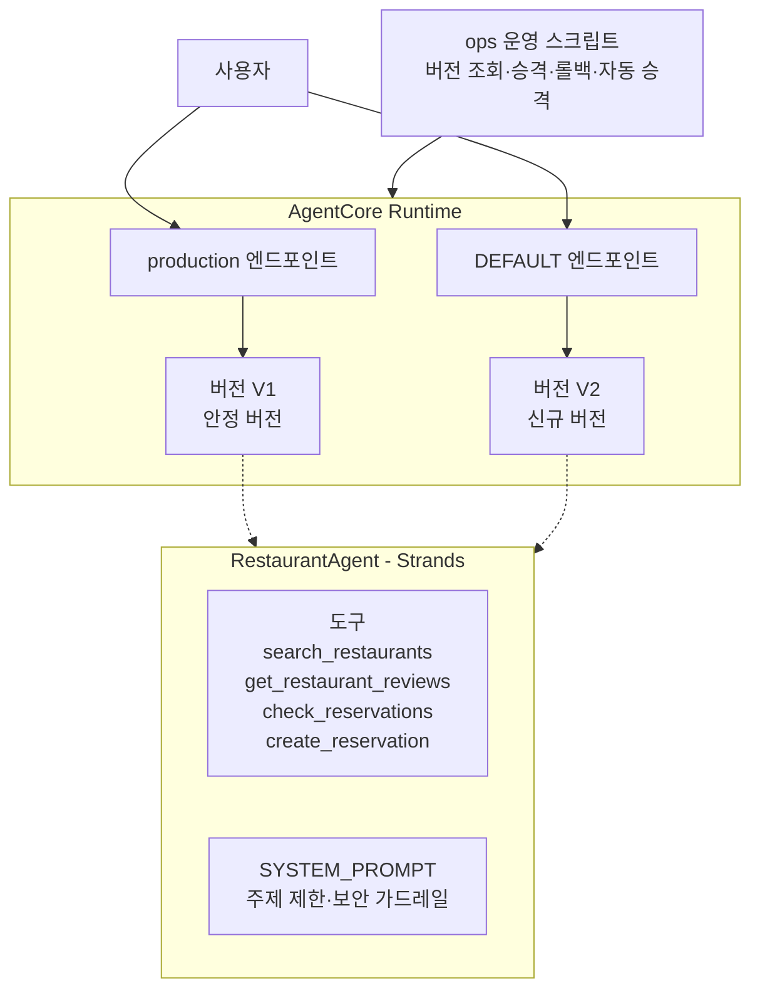
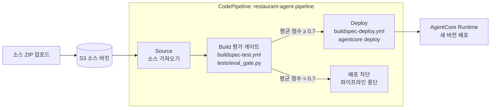

# Restaurant Agent AgentCore

Strands Agents SDK로 구현한 레스토랑 에이전트를 Amazon Bedrock AgentCore Runtime에 배포하고, 버전·엔드포인트 기반 카나리 배포와 롤백, 평가 게이트 기반 CI/CD 파이프라인까지 구성한 프로젝트입니다.

## 아키텍처



카나리 배포는 신규 버전(V2)을 `DEFAULT` 엔드포인트에 먼저 올려 검증하고, 오류율이 기준 이하이면 `production` 엔드포인트를 V2로 승격합니다. 문제가 있으면 이전 버전으로 롤백합니다.

## 프로젝트 구조

```text
RestaurantAgent/
├── agentcore/              # AgentCore CLI 설정(agentcore.json, aws-targets.json, .env.local)
├── app/
│   └── RestaurantAgent/    # 에이전트 애플리케이션 코드(main.py)
├── ops/                    # 버전·엔드포인트 운영 스크립트
├── tests/
│   └── eval_gate.py        # 배포 전 품질 평가 게이트
├── buildspec-test.yml      # CodeBuild: 평가 게이트 실행
├── buildspec-deploy.yml    # CodeBuild: 평가 통과 시 자동 배포
├── .env.example            # 로컬 환경 변수 키 템플릿
├── pyproject.toml
└── uv.lock
```

`ops/`에는 버전·엔드포인트 운영 스크립트가 순서대로 있습니다.

1. `01_list_versions.py`: 버전·엔드포인트 조회
2. `02_create_endpoint.py`: 버전이 고정된 production 엔드포인트 생성
3. `03_invoke_endpoint.py`: qualifier로 엔드포인트별 호출
4. `04_promote.py`: 카나리 검증 후 production 승격
5. `05_rollback.py`: 이전 버전으로 롤백
6. `06_auto_promote.py`: 카나리 오류율 자동 측정 후 기준 통과 시 자동 승격

## 환경 준비

- Python 3.13
- [uv](https://docs.astral.sh/uv/)
- Node.js와 npm(AgentCore CLI 설치는 첫 배포 브랜치에서 진행)
- Amazon Bedrock 및 AgentCore를 사용할 수 있는 AWS 자격 증명

```powershell
uv sync --frozen
```

`.env.example`을 참고해 로컬 `.env`를 구성합니다. `.env`와 `agentcore/.env.local`은 Git에 커밋하지 않습니다.

## CI/CD 파이프라인

에이전트 코드가 변경될 때마다 품질을 자동 평가하고, 평가를 통과할 때만 배포되는 CI/CD 루프를 AWS CodeBuild와 CodePipeline으로 구성했습니다.



- **평가 게이트**(`tests/eval_gate.py`): `strands-agents-evals`의 LLM-as-a-Judge로 세 가지 시나리오(이탈리안 추천, 매운맛 제외, 미확인 정보 추측 금지)를 채점합니다. 평균 점수가 임계값 미달이면 `exit 1`로 배포를 차단합니다.
- 평가 게이트는 배포되는 코드와 동일한 `SYSTEM_PROMPT`·도구 구성을 재사용해, 실제로 배포될 에이전트를 평가합니다.

로컬에서 평가 게이트만 실행하려면:

```powershell
uv run python tests/eval_gate.py
```

## 브랜치와 PR 단위

| 순서 | 브랜치 | 범위 |
| --- | --- | --- |
| 1 | `feature/agentcore-deployment` | Part 1: 프로젝트 확인, CLI 설정, 최초 배포·호출 |
| 2 | `feature/agent-tool-redeployment` | Part 2와 3: 도구 추가, 재배포, 콘솔 검증 |
| 3 | `feature/agentcore-version-endpoints` | Part 4 전반: `01`~`03` 조회·생성·호출 스크립트 |
| 4 | `feature/agentcore-canary-rollout` | Part 4 후반: `04`~`05` 승격·롤백 스크립트 |
| 5 | `feature/ci-pipeline` | 평가 게이트 기반 CodeBuild/CodePipeline CI/CD 구성 |

각 브랜치는 `main`에서 생성하고, 검토와 검증을 마친 뒤 PR을 squash merge하고 삭제합니다. 콘솔 확인만 필요한 Part 3은 별도 코드 브랜치로 나누지 않고 Part 2 PR의 검증 결과에 기록합니다.

## 참고

- [AWS AgentCore Runtime Python 배포 가이드](https://docs.aws.amazon.com/bedrock-agentcore/latest/devguide/runtime-get-started-code-deploy-python.html)
- [Strands Agents 문서](https://strandsagents.com/latest/)
