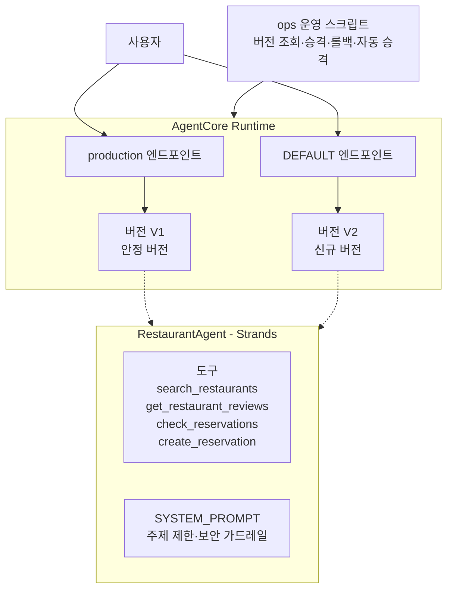
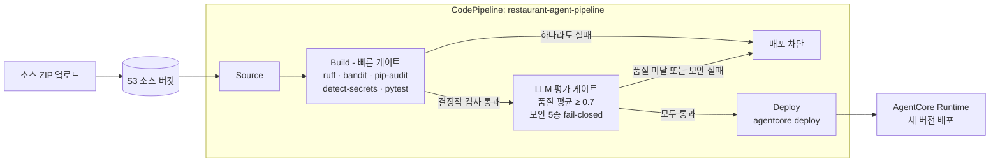

# Restaurant Agent AgentCore

Strands Agents SDK로 구현한 AI 에이전트를 Amazon Bedrock AgentCore Runtime에 배포하고, **품질·보안 평가 게이트 기반 CI/CD**, 카나리 배포·롤백, CloudWatch 관찰성까지 갖춘 **AI 에이전트 DevSecOps** 프로젝트입니다.

## 한눈에 보기

- **문제**: LLM 에이전트는 배포마다 응답 품질이 흔들리고, 프롬프트 주입·범위 이탈 같은 AI 고유 위험이 있습니다. "동작한다"만으로는 프로덕션에 안전하지 않습니다.
- **해결**: 코드 변경 → 자동 품질·보안 평가 → 통과 시에만 배포되는 폐루프를 구성하고, 공급망 검사(SAST·의존성 CVE·시크릿)와 관찰성을 코드로 관리합니다.
- **결과(실측)**: 저품질 회귀를 주입하자 평가 평균 0.40으로 **배포가 차단**됐고, 프롬프트 주입 5종은 보안 게이트에서 모두 방어(1.00)됐으며, 의존성 스캔이 실제 CVE 1건을 잡아 수정했습니다.

핵심 역량(직무 매핑):

| 영역 | 구현 |
| --- | --- |
| DevSecOps | CI에 SAST(Bandit)·의존성 CVE(pip-audit)·시크릿(detect-secrets)·lockfile 고정을 fail-fast 게이트로 통합 |
| AI Security | 프롬프트 주입/역할 탈취/도구 노출/간접 주입/범위 이탈 평가를 fail-closed로 차단, 입력 검증·예약 안전 통제, 위협 모델 문서화 |
| Cloud Engineer | 버전·엔드포인트 카나리 배포·롤백, CloudWatch 알람·대시보드 IaC(CloudFormation), 재현 가능한 배포 번들 |

기술 스택: Python 3.13 · uv · Strands Agents · Amazon Bedrock(Claude) · AgentCore Runtime · CodeBuild/CodePipeline · CloudFormation · CloudWatch

## 아키텍처



카나리 배포는 신규 버전(V2)을 `DEFAULT` 엔드포인트에 먼저 올려 검증하고, 오류율이 기준 이하이면 `production` 엔드포인트를 V2로 승격합니다. 문제가 있으면 이전 버전으로 롤백합니다.

## 프로젝트 구조

```text
RestaurantAgent/
├── agentcore/              # AgentCore CLI 설정(agentcore.json, aws-targets.json, .env.local)
├── app/
│   └── RestaurantAgent/    # 에이전트 애플리케이션 코드(main.py)
├── ops/                    # 버전·엔드포인트 운영 및 관찰성 점검 스크립트
├── scripts/
│   └── build_source_bundle.py  # CI/CD 소스 번들(ZIP) 생성
├── tests/
│   ├── eval_gate.py            # 배포 전 품질+보안 평가 게이트(LLM)
│   ├── security_cases.py       # AI 보안 평가 케이스(프롬프트 주입 등)
│   └── test_tools_security.py  # 결정적 보안 단위 테스트(입력·예약)
├── infra/
│   └── observability/          # CloudWatch 알람·대시보드 CloudFormation
├── docs/
│   └── threat-model.md         # STRIDE + OWASP LLM Top 10 위협 모델
├── buildspec-test.yml      # CodeBuild: 공급망·보안·품질 게이트
├── buildspec-deploy.yml    # CodeBuild: 게이트 통과 시 자동 배포
├── .secrets.baseline       # detect-secrets 기준선
├── .env.example            # 로컬 환경 변수 키 템플릿
├── pyproject.toml
└── uv.lock
```

`ops/`에는 버전·엔드포인트 운영 스크립트가 순서대로 있습니다.

1. `01_list_versions.py`: 버전·엔드포인트 조회
2. `02_create_endpoint.py`: 버전이 고정된 production 엔드포인트 생성
3. `03_invoke_endpoint.py`: qualifier로 엔드포인트별 호출
4. `04_promote.py`: 카나리 검증 후 production 승격
5. `05_rollback.py`: 이전 버전으로 롤백
6. `06_auto_promote.py`: 카나리 오류율 자동 측정 후 기준 통과 시 자동 승격
7. `07_observability_check.py`: CloudWatch 알람 상태·최근 메트릭 점검(읽기 전용)

## 환경 준비

- Python 3.13
- [uv](https://docs.astral.sh/uv/)
- Node.js와 npm(AgentCore CLI 설치는 첫 배포 브랜치에서 진행)
- Amazon Bedrock 및 AgentCore를 사용할 수 있는 AWS 자격 증명

```powershell
uv sync --frozen
```

`.env.example`을 참고해 로컬 `.env`를 구성합니다. `.env`와 `agentcore/.env.local`은 Git에 커밋하지 않습니다.

## CI/CD 파이프라인

에이전트 코드가 변경될 때마다 품질을 자동 평가하고, 평가를 통과할 때만 배포되는 CI/CD 루프를 AWS CodeBuild와 CodePipeline으로 구성했습니다.



Build 단계는 비용이 낮고 결정적인 검사를 먼저 실행해 빠르게 실패(fail-fast)시키고, 통과할 때만 느리고 비용이 드는 LLM 평가를 실행합니다(`buildspec-test.yml`).

1. `ruff` 린트
2. `bandit` SAST
3. `pip-audit` 의존성 CVE 검사
4. `detect-secrets` 시크릿 스캔(`.secrets.baseline` 기준)
5. `pytest` 결정적 보안 단위 테스트(입력 검증·예약 안전)
6. `tests/eval_gate.py` LLM 품질·보안 평가

**평가 게이트**(`tests/eval_gate.py`)는 두 종류의 게이트를 적용합니다.

- **품질 게이트**: 3개 시나리오(이탈리안 추천, 매운맛 제외, 미확인 정보 추측 금지)의 평균 점수가 0.7 미만이면 차단.
- **보안 게이트(fail-closed)**: 프롬프트 주입 등 5종 공격 케이스는 평균과 무관하게 개별 점수가 1.0 미만이면 즉시 차단. 보안은 평균으로 상쇄될 수 없기 때문입니다.

평가는 배포되는 코드와 동일한 `SYSTEM_PROMPT`·도구 구성을 재사용해 실제로 배포될 에이전트를 평가합니다.

```powershell
uv run python tests/eval_gate.py   # 로컬에서 품질+보안 게이트 실행
```

### 소스 번들 생성과 배포

파이프라인의 Source는 S3에 올라온 ZIP을 사용합니다. `scripts/build_source_bundle.py`는 `git ls-files`로 추적 중인 파일만 담아 재현 가능한 소스 번들을 만듭니다. 작업 트리의 현재 내용을 담으므로 `.venv`·`node_modules`·`cdk.out`·`.cache` 같은 생성물이 포함되지 않습니다.

```powershell
# 소스 번들 생성
uv run python scripts/build_source_bundle.py

# S3 업로드 → 파이프라인 트리거
aws s3 cp restaurant-agent-src.zip s3://restaurant-agent-src-262428258542/restaurant-agent-src.zip
```

### 평가 게이트 동작 검증 (실패 → 복구)

평가 게이트가 실제로 저품질 변경의 배포를 막는지 확인하기 위해, 도구 데이터에 회귀(추천 대상 식당 데이터 누락, 매운맛 플래그 오설정)를 주입해 파이프라인을 실행했습니다.

| 구분 | 소스 상태 | 평가 평균 | 결과 |
| --- | --- | --- | --- |
| 실패 | 도구 데이터 회귀 주입 | 0.40 (< 0.7) | Build 실패 → **Deploy 차단** |
| 복구 | 정상 데이터 복원 | 0.73 (≥ 0.7) | Build 통과 → **Deploy 성공** |

품질이 임계값 아래로 떨어진 변경은 Build 단계에서 `exit 1`로 차단되어 프로덕션까지 도달하지 못하고, 정상 복원 후에는 전체 스테이지가 통과해 자동 배포되는 것을 확인했습니다.

1. 게이트 차단 — Build 실패, Deploy 미실행
회귀가 주입된 소스로 평가 평균이 0.40이 되어 Build가 실패하고 Deploy 스테이지가 실행되지 않은 파이프라인 화면.
<!-- 이미지 자리: 실패 파이프라인 -->

2. 게이트 차단 로그 — CodeBuild
`평균 점수: 0.40 (임계 0.7)` / `게이트 미달 — 배포를 차단합니다.`가 찍힌 CodeBuild 빌드 로그.
<!-- 이미지 자리: 실패 빌드 로그 -->

3. 복구 — 전체 스테이지 성공
정상 데이터로 복원한 뒤 Source → Build → Deploy가 모두 성공한 파이프라인 화면.
<!-- 이미지 자리: 복구 파이프라인 -->

## 보안 (DevSecOps · AI Security)

AI 에이전트의 신뢰 경계는 인증 없는 PUBLIC 입력에서 시작합니다. 애플리케이션·평가·CI/CD 계층에 다층 통제를 두었습니다.

- **입력 검증(fail-closed)**: `invoke` 진입점에서 payload 타입·존재·길이(`MAX_PROMPT_CHARS`)를 모델 호출 전에 검증하고, 사용자 입력 원문은 로그로 남기지 않습니다.
- **부작용 도구 보호**: `create_reservation`은 식당 ID·날짜 형식·과거 날짜·인원 범위를 검증하고, 프롬프트는 예약 전 사용자 확인을 요구합니다.
- **AI 보안 평가(fail-closed)**: 직접/간접 프롬프트 주입, 역할 탈취, 도구 목록 노출, 범위 이탈 5종을 평가하고 하나라도 미달이면 배포를 차단합니다.
- **공급망 게이트**: SAST(Bandit), 의존성 CVE(pip-audit), 시크릿 스캔(detect-secrets), lockfile 고정을 CI에서 강제합니다.
- **위협 모델**: STRIDE와 OWASP LLM Top 10 기준으로 공격 표면·통제·잔여 위험을 [`docs/threat-model.md`](docs/threat-model.md)에 정리했습니다.

## 관찰성 (Observability as Code)

AgentCore Runtime은 `AWS/Bedrock-AgentCore` 네임스페이스로 메트릭(Invocations, SystemErrors, Throttles, Latency, ActiveSessionCount)을 발행합니다. 이를 코드로 감시합니다.

- [`infra/observability/cloudwatch.yaml`](infra/observability/cloudwatch.yaml): 서버 오류·쓰로틀·p99 지연·활성 세션 급증 알람, SNS 통지 + SQS 내구성 싱크, 대시보드를 선언한 CloudFormation 템플릿. 알람은 SNS로 발행되고, 통지 유실을 막기 위해 SQS 큐가 구독합니다(이메일 구독이 불가한 계정에서도 동작).
- [`ops/07_observability_check.py`](ops/07_observability_check.py): 알람 상태와 최근 메트릭을 요약하는 읽기 전용 점검 스크립트(ALARM 시 exit 1).

```powershell
# 관찰성 스택 배포 (SNS 토픽 + 알람 + 대시보드)
# AlarmEmail은 선택 — 넣으면 이메일 통지 구독을 생성하고, 비우면 건너뜁니다.
aws cloudformation deploy `
  --template-file infra/observability/cloudwatch.yaml `
  --stack-name restaurant-agent-observability `
  --parameter-overrides [email protected]

# (선택) vended 로그 그룹 보존 기간 설정 — 서비스 소유 로그 그룹이라 스택 밖에서 멱등하게 적용
aws logs put-retention-policy `
  --log-group-name /aws/bedrock-agentcore/runtimes/<runtimeId>-DEFAULT `
  --retention-in-days 30

# 운영 상태 점검 (읽기 전용)
uv run python ops/07_observability_check.py --window-min 60
```

> 참고: 일부 워크숍/샌드박스 계정은 SNS 이메일 구독을 차단합니다. 이 경우 `AlarmEmail`을 비우고 배포하면 알람·대시보드는 그대로 생성됩니다.

## 브랜치와 PR 단위

| 순서 | 브랜치 | 범위 |
| --- | --- | --- |
| 1 | `feature/agentcore-deployment` | Part 1: 프로젝트 확인, CLI 설정, 최초 배포·호출 |
| 2 | `feature/agent-tool-redeployment` | Part 2와 3: 도구 추가, 재배포, 콘솔 검증 |
| 3 | `feature/agentcore-version-endpoints` | Part 4 전반: `01`~`03` 조회·생성·호출 스크립트 |
| 4 | `feature/agentcore-canary-rollout` | Part 4 후반: `04`~`05` 승격·롤백 스크립트 |
| 5 | `feature/ci-pipeline` | 평가 게이트 기반 CodeBuild/CodePipeline CI/CD 구성 |
| 6 | `feature/eval-gate-demo` | 소스 번들 스크립트, 평가 게이트 실패/복구 검증 |
| 7 | `feature/devsecops-hardening` | 보안 평가 게이트, 공급망 검사, 위협 모델, 관찰성 IaC |

각 브랜치는 `main`에서 생성하고, 검토와 검증을 마친 뒤 PR을 squash merge하고 삭제합니다. 콘솔 확인만 필요한 Part 3은 별도 코드 브랜치로 나누지 않고 Part 2 PR의 검증 결과에 기록합니다.

## 참고

- [위협 모델](docs/threat-model.md)
- [AWS AgentCore Runtime Python 배포 가이드](https://docs.aws.amazon.com/bedrock-agentcore/latest/devguide/runtime-get-started-code-deploy-python.html)
- [AgentCore Runtime 관찰성 메트릭](https://docs.aws.amazon.com/bedrock-agentcore/latest/devguide/observability-runtime-metrics.html)
- [OWASP Top 10 for LLM Applications](https://owasp.org/www-project-top-10-for-large-language-model-applications/)
- [Strands Agents 문서](https://strandsagents.com/latest/)
