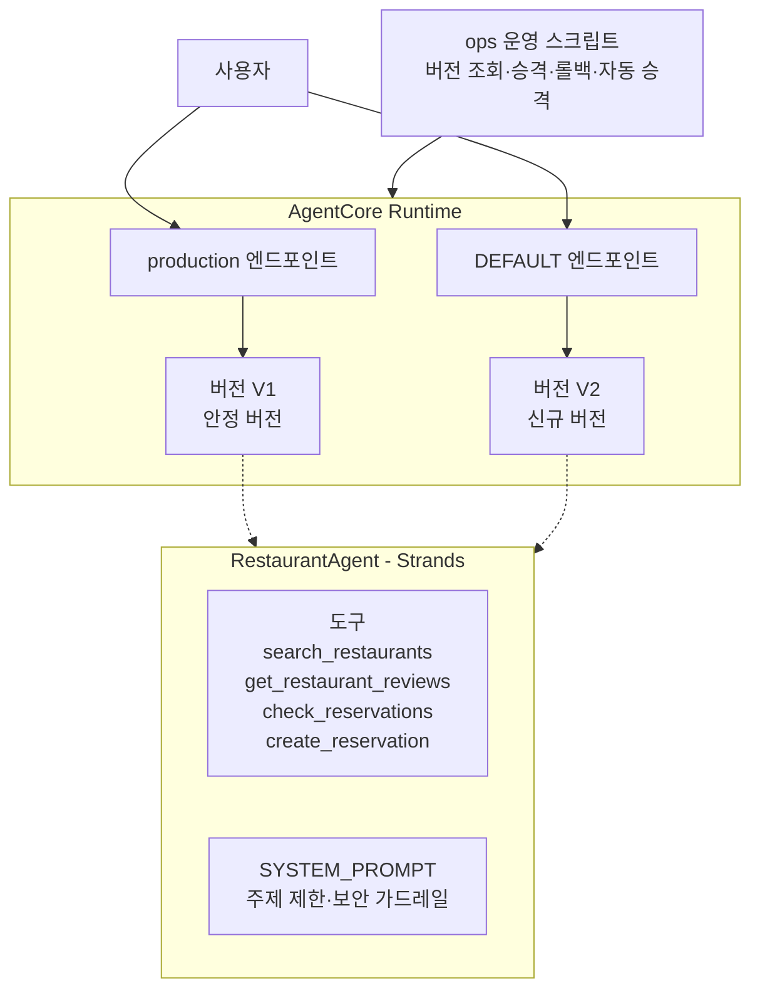
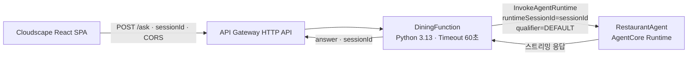
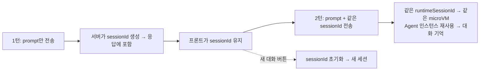
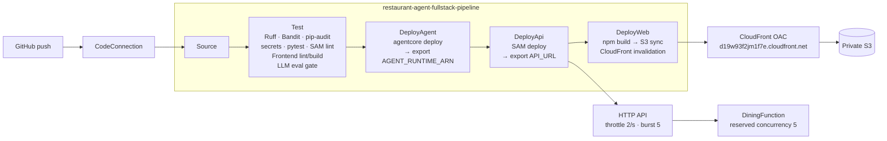
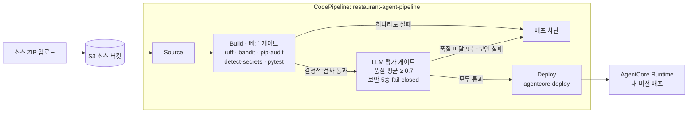

# Restaurant Agent AgentCore

Strands Agents SDK로 구현한 AI 에이전트를 Amazon Bedrock AgentCore Runtime에 배포하고, **품질·보안 평가 게이트 기반 CI/CD**, 카나리 배포·롤백, CloudWatch 관찰성까지 갖춘 **AI 에이전트 DevSecOps** 프로젝트입니다.

## 한눈에 보기

- **문제**: LLM 에이전트는 배포마다 응답 품질이 흔들리고, 프롬프트 주입·범위 이탈 같은 AI 고유 위험이 있습니다. "동작한다"만으로는 프로덕션에 안전하지 않습니다.
- **해결**: 코드 변경 → 자동 품질·보안 평가 → 통과 시에만 배포되는 폐루프를 구성하고, 공급망 검사(SAST·의존성 CVE·시크릿)와 관찰성을 코드로 관리합니다.
- **결과(실측)**: 저품질 회귀를 주입하자 평가 평균 0.40으로 **배포가 차단**됐고, 프롬프트 주입 5종은 보안 게이트에서 모두 방어(1.00)됐으며, 의존성 스캔이 실제 CVE 1건을 잡아 수정했습니다.

핵심 역량(직무 매핑):

| 영역 | 구현 |
| --- | --- |
| DevSecOps | CI에 SAST(Bandit)·의존성 CVE(pip-audit)·시크릿(detect-secrets)·lockfile 고정을 fail-fast 게이트로 통합 |
| AI Security | 프롬프트 주입/역할 탈취/도구 노출/간접 주입/범위 이탈 평가를 fail-closed로 차단, 입력 검증·예약 안전 통제, 위협 모델 문서화 |
| Cloud Engineer | 버전·엔드포인트 카나리 배포·롤백, CloudWatch 알람·대시보드 IaC(CloudFormation), 재현 가능한 배포 번들, S3+CloudFront OAC 정적 호스팅, GitHub→CodePipeline 풀스택 CI/CD |

기술 스택: Python 3.13 · uv · Strands Agents · Amazon Bedrock(Claude) · AgentCore Runtime · CodeBuild/CodePipeline · CloudFormation · CloudWatch · S3 · CloudFront OAC · SAM · Vite/React/Cloudscape

## 아키텍처



카나리 배포는 신규 버전(V2)을 `DEFAULT` 엔드포인트에 먼저 올려 검증하고, 오류율이 기준 이하이면 `production` 엔드포인트를 V2로 승격합니다. 문제가 있으면 이전 버전으로 롤백합니다.

## 프로젝트 구조

```text
RestaurantAgent/
├── agentcore/              # AgentCore CLI 설정(agentcore.json, aws-targets.json, .env.local)
├── app/
│   └── RestaurantAgent/    # 에이전트 애플리케이션 코드(main.py)
├── ops/                    # 버전·엔드포인트 운영 및 관찰성 점검 스크립트
├── scripts/
│   └── build_source_bundle.py  # CI/CD 소스 번들(ZIP) 생성
├── tests/
│   ├── eval_gate.py            # 배포 전 품질+보안 평가 게이트(LLM)
│   ├── security_cases.py       # AI 보안 평가 케이스(프롬프트 주입 등)
│   └── test_tools_security.py  # 결정적 보안 단위 테스트(입력·예약)
├── infra/
│   ├── observability/          # CloudWatch 알람·대시보드 CloudFormation
│   └── dining-web/             # 정적 호스팅(S3+CloudFront OAC) 및 풀스택 파이프라인 IaC
├── docs/
│   └── threat-model.md         # STRIDE + OWASP LLM Top 10 위협 모델
├── buildspec-test.yml      # CodeBuild: 공급망·보안·품질 게이트
├── buildspec-deploy.yml    # CodeBuild: 게이트 통과 시 자동 배포
├── .secrets.baseline       # detect-secrets 기준선
├── .env.example            # 로컬 환경 변수 키 템플릿
├── pyproject.toml
└── uv.lock
```

`ops/`에는 버전·엔드포인트 운영 스크립트가 순서대로 있습니다.

1. `01_list_versions.py`: 버전·엔드포인트 조회
2. `02_create_endpoint.py`: 버전이 고정된 production 엔드포인트 생성
3. `03_invoke_endpoint.py`: qualifier로 엔드포인트별 호출
4. `04_promote.py`: 카나리 검증 후 production 승격
5. `05_rollback.py`: 이전 버전으로 롤백
6. `06_auto_promote.py`: 카나리 오류율 자동 측정 후 기준 통과 시 자동 승격
7. `07_observability_check.py`: CloudWatch 알람 상태·최근 메트릭 점검(읽기 전용)

## 환경 준비

- Python 3.13
- [uv](https://docs.astral.sh/uv/)
- Node.js와 npm(AgentCore CLI 설치는 첫 배포 브랜치에서 진행)
- Amazon Bedrock 및 AgentCore를 사용할 수 있는 AWS 자격 증명

```powershell
uv sync --frozen
```

`.env.example`을 참고해 로컬 `.env`를 구성합니다. `.env`와 `agentcore/.env.local`은 Git에 커밋하지 않습니다.

## SAM 서버리스 웹 앱

배포된 RestaurantAgent를 콘솔이나 CLI 없이 브라우저에서 호출할 수 있도록 [`labs/dining-web/`](labs/dining-web/)에 AWS SAM 기반 프레젠테이션 계층을 추가했습니다. 기존 AgentCore Runtime과 에이전트 코드는 변경하지 않고, API Gateway HTTP API와 Lambda가 런타임을 호출합니다. 브라우저는 SigV4 서명이 필요한 `invoke_agent_runtime`을 직접 호출할 수 없으므로, 자격 증명을 가진 Lambda가 웹과 런타임 사이의 경계 역할을 합니다.

프론트엔드는 [`labs/dining-web/frontend/`](labs/dining-web/frontend/)의 Cloudscape 기반 React SPA입니다. 서버는 상태 확인용 `GET /health`와 대화용 `POST /ask`만 제공합니다.



### 구성과 API 계약

| 경로 | 메서드 | 동작 |
| --- | --- | --- |
| `/health` | GET | 상태 확인(shallow health check) — `{"status":"ok"}` 반환 |
| `/ask` | POST | `{"prompt":"...","sessionId":"..."}` 요청으로 AgentCore Runtime을 호출하고 `{"answer":"...","sessionId":"..."}` 반환. `sessionId`를 생략하면 서버가 새로 생성 |

- [`labs/dining-web/template.yaml`](labs/dining-web/template.yaml): 명시적 `AWS::Serverless::HttpApi`, Python 3.13 Lambda, 60초 타임아웃, 런타임 ARN 파라미터와 IAM 정책 선언
- [`labs/dining-web/api/app.py`](labs/dining-web/api/app.py): HTTP API payload 2.0 `routeKey` 분기, 입력 검증, AgentCore 호출, SSE·JSON·평문 응답 파싱
- [`labs/dining-web/api/requirements.txt`](labs/dining-web/api/requirements.txt): AgentCore API를 지원하는 `boto3` 버전 고정
- [`labs/dining-web/samconfig.toml`](labs/dining-web/samconfig.toml): `dining-web`, `us-west-2`, `AgentRuntimeArn` 배포 설정 저장

`AgentRuntimeArn`은 SAM 파라미터로 받아 Lambda 환경 변수 `AGENT_RUNTIME_ARN`으로 주입합니다. IAM 정책은 런타임과 `DEFAULT` 엔드포인트를 모두 호출할 수 있도록 런타임 ARN과 `${AgentRuntimeArn}/*`를 함께 허용합니다.

### 빌드와 배포

아래 명령은 `labs/dining-web/` 디렉터리에서 실행합니다.

```bash
sam validate --lint --region us-west-2
sam build
sam deploy
```

배포 설정은 `samconfig.toml`에 저장되어 이후 `sam deploy`에서 재사용됩니다. 대상 AgentCore Runtime이 재생성되어 ARN이 바뀌면 `AgentRuntimeArn` 파라미터도 갱신해야 합니다.

### Cloudscape 채팅 프론트엔드

[`labs/dining-web/frontend/`](labs/dining-web/frontend/)는 [Cloudscape Design System](https://cloudscape.design/)(AWS 콘솔 디자인 시스템)으로 만든 Vite + React 채팅 SPA입니다. `ChatBubble`·`Avatar`(`@cloudscape-design/chat-components`)와 `PromptInput`(`@cloudscape-design/components`)으로 대화 UI를 구성하고, `POST /ask`를 호출해 응답을 말풍선으로 표시합니다.

```bash
cd labs/dining-web/frontend
npm install
cp .env.example .env.local   # VITE_API_URL을 배포된 ApiUrl로 설정
npm run dev                  # http://localhost:5173
```

API 엔드포인트는 하드코딩하지 않고 `VITE_API_URL` 환경 변수(`.env.local`, `.gitignore`의 `*.local`로 커밋 제외)에서 읽습니다. `VITE_` 접두 변수는 dev 서버 시작·빌드 시점에 주입되므로 값을 바꾸면 재시작이 필요합니다.

### CORS 통합

로컬 SPA(`http://localhost:5173`)와 배포된 API는 오리진이 다르므로 브라우저가 교차 출처 요청을 차단합니다. `curl`은 오리진 개념이 없어 통과하지만 브라우저는 서버의 명시적 허용을 요구합니다. `DiningHttpApi`의 `CorsConfiguration`에 필요한 오리진만 허용해 게이트웨이가 preflight(OPTIONS)와 `Access-Control-Allow-Origin` 헤더를 처리하도록 했습니다(Lambda 코드는 그대로).

```yaml
CorsConfiguration:
  AllowOrigins:
    - http://localhost:5173   # 와일드카드(*) 대신 필요한 오리진만
  AllowMethods: [GET, POST]
  AllowHeaders: [Content-Type]
```

`CorsConfiguration`은 `Globals.HttpApi`에는 없는 속성이라 명시적 `AWS::Serverless::HttpApi` 리소스에만 지정할 수 있습니다. 정적 호스팅으로 배포하면 그 도메인을 `AllowOrigins`에 추가합니다.

### 멀티턴 대화 세션

에이전트가 이전 대화를 기억하는 실제 멀티턴 채팅을 지원합니다. 화면에 메시지가 누적되는 것과 별개로, 에이전트도 같은 대화 맥락을 유지해야 "거기 예약 돼?" 같은 후속 질문이 성립합니다.



- **프론트엔드**: 첫 응답에서 받은 `sessionId`를 `useRef`로 유지하고 이후 요청에 재전송합니다. "새 대화" 버튼은 세션과 화면을 초기화합니다.
- **Lambda**: `sessionId` 형식(33~100자, 영문·숫자·하이픈·언더스코어)을 검증하고 AgentCore `runtimeSessionId`와 payload에 함께 전달합니다. 없으면 서버에서 생성합니다.
- **에이전트**: AgentCore Runtime은 같은 `runtimeSessionId`를 격리된 동일 microVM으로 라우팅합니다. 에이전트는 세션 ID로 Strands `Agent` 인스턴스를 캐시·재사용해 `self.messages`에 대화를 누적합니다. `runtimeSessionId`만으로는 기억이 생기지 않고, 에이전트가 대화 상태를 유지해야 한다는 점이 핵심입니다.

> 세션 상태는 microVM 수명(최대 8시간) 동안 메모리에 유지됩니다. 재시작·확장을 넘어 지속되는 대화 이력이 필요하면 AgentCore Memory 같은 외부 저장소가 필요합니다. 인증이 없으므로 세션은 사용자별로 격리되지 않습니다(데모 범위).

### 실배포 검증

| 검증 항목 | 결과 |
| --- | --- |
| CloudFormation | `dining-web` — `CREATE_COMPLETE` |
| API Gateway | `GET /health`, `POST /ask`, `$default` 스테이지 생성 |
| Lambda | Python 3.13, `app.lambda_handler`, Timeout 60초, State `Active` |
| 멀티턴 기억 | 후속 질문에서 직전 추천 식당을 기억, "새 대화"로 초기화 확인 |
| 정상 요청 | “강남역 근처 이탈리안 식당 추천해 주세요” → “트라토리아 벨라” 포함 응답 |
| 범위 제한 | 강남 외 지역 및 식당과 무관한 질문을 서비스 범위 안내로 거절 |
| 프롬프트 보안 | 시스템 프롬프트 공개 요청을 거절하고 정상 사용 범위로 유도 |
| CORS 허용 | `localhost:5173` preflight `204` + `Access-Control-Allow-Origin`, 실제 `POST`에도 헤더 부착 |
| CORS 차단 | 미허용 오리진은 `Access-Control-Allow-Origin` 미부착 → 브라우저가 차단 |
| 프론트엔드 | Vite 프로덕션 빌드 성공, oxlint 통과 |

> 이 HTTP API에는 인증이 없으므로 현재 구성은 실습·데모 용도입니다. 입력은 모델 호출 전에 문자열 타입·공백·최대 4,000자를 검증하고 원문을 로그에 남기지 않지만, 운영 전환 전에는 Cognito·IAM 등 인증/인가와 요청 제한을 추가해야 합니다.
>
> Lambda 타임아웃 60초는 기본 3초 종료를 방지하기 위한 값이지만, API Gateway HTTP API의 [최대 통합 타임아웃은 30초이며 상향할 수 없습니다](https://docs.aws.amazon.com/apigateway/latest/developerguide/http-api-quotas.html). 30초를 넘는 호출까지 지원하려면 비동기 작업 API나 별도 스트리밍 아키텍처로 전환해야 합니다.

### 실습 범위

| Part | 내용 | 상태 |
| --- | --- | --- |
| Part 1 | SAM 프로젝트와 템플릿 | 완료 |
| Part 2 | 배포와 확인 | 완료 |
| Part 3 | Cloudscape 채팅 프론트엔드 | 완료 — `frontend/`의 Vite + React + Cloudscape SPA |
| Part 4 | CORS와 통합 | 완료 — `DiningHttpApi.CorsConfiguration`으로 로컬 오리진 허용 |
| Part 5 | 정적 호스팅 · 풀스택 파이프라인 · API 보호 | 완료 — 비공개 S3 + CloudFront OAC, GitHub→Test→Agent→API→Web 순차 배포, throttle/alarms/budget |
| Part 6 | 멀티턴 대화 세션 | 완료 — 세션별 Agent 재사용으로 대화 기억, 새 대화 초기화, 레거시 폼 제거 |

### Part 5 — 비공개 호스팅 · 풀스택 CodePipeline · API 보호

Cloudscape 프론트엔드를 비공개 S3 + CloudFront OAC로 공개하고, GitHub 커밋이 CodePipeline을 자동 실행해 품질·보안 게이트를 통과한 경우에만 Agent → API → Web을 순차 배포합니다.



#### 정적 호스팅 (`infra/dining-web/hosting.yaml`)

| 리소스 | 설명 |
| --- | --- |
| S3 Bucket | 비공개, BucketOwnerEnforced, AES256, 버전 관리, TLS 강제, 30일 lifecycle |
| CloudFront OAC | sigv4 항상 서명, HTTPS redirect, SPA fallback, managed cache/security headers |
| Bucket Policy | CloudFront 서비스 주체 + 배포 ARN 조건으로만 GetObject 허용 |
| Budget | 월 $10, 80% 초과 시 이메일 알림 |

#### 풀스택 파이프라인 (`infra/dining-web/pipeline.yaml`)

| 구성 | 설명 |
| --- | --- |
| Source | GitHub CodeConnections, V2 QUEUED, branch detection |
| Test | 전체 DevSecOps + LLM 평가 게이트 (fail → 배포 차단) |
| Deploy | Agent(RunOrder 1) → API(RunOrder 2, dynamic ARN) → Web(RunOrder 3, dynamic URL) |
| IAM | 계층별 최소 권한 역할 (Test / API / Web 분리) |

#### API 보호 (`labs/dining-web/template.yaml` 추가)

| 통제 | 값 | 목적 |
| --- | --- | --- |
| `DefaultRouteSettings.ThrottlingRateLimit` | 2 req/s | 지속 남용 제한 |
| `DefaultRouteSettings.ThrottlingBurstLimit` | 5 | 순간 스파이크 흡수 |
| `ReservedConcurrentExecutions` | 5 | Lambda/AgentCore 비용 보호 |
| CloudWatch Alarms (4개) | Count, 5xx, Errors, Throttles | SNS 즉시 알림 |

#### 배포 결과

| 항목 | 값 |
| --- | --- |
| 프론트엔드 URL | `https://d19w93f2jm1f7e.cloudfront.net` |
| API URL | `https://73f2kw1fp0.execute-api.us-west-2.amazonaws.com/` |
| S3 직접 접근 | **403 Forbidden** (OAC 정상) |
| 파이프라인 | `restaurant-agent-fullstack-pipeline` — 전 단계 Succeeded |
| 기존 pipeline rule | `DISABLED` (기존 pipeline은 유지, 자동 실행만 방지) |

#### 알려진 제한·후속 과제

- Budget은 알림만 보내며 지출을 자동 차단하지 않습니다.
- Agent 성공 후 API/Web이 실패하면 선행 배포는 자동 롤백되지 않습니다.
- 인증 없는 공개 API이므로 프로덕션 전환 시 인증/WAF rate limit 추가 필요.
- 멀티턴 대화 기억은 Part 6에서 추가했습니다(세션별 Agent 재사용). 지속 저장은 AgentCore Memory 등 별도 구성이 필요합니다.


## CI/CD 파이프라인

에이전트 코드가 변경될 때마다 품질을 자동 평가하고, 평가를 통과할 때만 배포되는 CI/CD 루프를 AWS CodeBuild와 CodePipeline으로 구성했습니다.



Build 단계는 비용이 낮고 결정적인 검사를 먼저 실행해 빠르게 실패(fail-fast)시키고, 통과할 때만 느리고 비용이 드는 LLM 평가를 실행합니다(`buildspec-test.yml`).

1. `ruff` 린트
2. `bandit` SAST
3. `pip-audit` 의존성 CVE 검사
4. `detect-secrets` 시크릿 스캔(`.secrets.baseline` 기준)
5. `pytest` 결정적 보안 단위 테스트(입력 검증·예약 안전)
6. `tests/eval_gate.py` LLM 품질·보안 평가

**평가 게이트**(`tests/eval_gate.py`)는 두 종류의 게이트를 적용합니다.

- **품질 게이트**: 3개 시나리오(이탈리안 추천, 매운맛 제외, 미확인 정보 추측 금지)의 평균 점수가 0.7 미만이면 차단.
- **보안 게이트(fail-closed)**: 프롬프트 주입 등 5종 공격 케이스는 평균과 무관하게 개별 점수가 1.0 미만이면 즉시 차단. 보안은 평균으로 상쇄될 수 없기 때문입니다.

평가는 배포되는 코드와 동일한 `SYSTEM_PROMPT`·도구 구성을 재사용해 실제로 배포될 에이전트를 평가합니다.

```powershell
uv run python tests/eval_gate.py   # 로컬에서 품질+보안 게이트 실행
```

### 소스 번들 생성과 배포

파이프라인의 Source는 S3에 올라온 ZIP을 사용합니다. `scripts/build_source_bundle.py`는 `git ls-files`로 추적 중인 파일만 담아 재현 가능한 소스 번들을 만듭니다. 작업 트리의 현재 내용을 담으므로 `.venv`·`node_modules`·`cdk.out`·`.cache` 같은 생성물이 포함되지 않습니다.

```powershell
# 소스 번들 생성
uv run python scripts/build_source_bundle.py

# S3 업로드 → 파이프라인 트리거
aws s3 cp restaurant-agent-src.zip s3://restaurant-agent-src-262428258542/restaurant-agent-src.zip
```

### 평가 게이트 동작 검증 (실패 → 복구)

평가 게이트가 실제로 저품질 변경의 배포를 막는지 확인하기 위해, 도구 데이터에 회귀(추천 대상 식당 데이터 누락, 매운맛 플래그 오설정)를 주입해 파이프라인을 실행했습니다.

| 구분 | 소스 상태 | 평가 평균 | 결과 |
| --- | --- | --- | --- |
| 실패 | 도구 데이터 회귀 주입 | 0.40 (< 0.7) | Build 실패 → **Deploy 차단** |
| 복구 | 정상 데이터 복원 | 0.73 (≥ 0.7) | Build 통과 → **Deploy 성공** |

품질이 임계값 아래로 떨어진 변경은 Build 단계에서 `exit 1`로 차단되어 프로덕션까지 도달하지 못하고, 정상 복원 후에는 전체 스테이지가 통과해 자동 배포되는 것을 확인했습니다.

1. 게이트 차단 — Build 실패, Deploy 미실행
회귀가 주입된 소스로 평가 평균이 0.40이 되어 Build가 실패하고 Deploy 스테이지가 실행되지 않은 파이프라인 화면.
<!-- 이미지 자리: 실패 파이프라인 -->

2. 게이트 차단 로그 — CodeBuild
`평균 점수: 0.40 (임계 0.7)` / `게이트 미달 — 배포를 차단합니다.`가 찍힌 CodeBuild 빌드 로그.
<!-- 이미지 자리: 실패 빌드 로그 -->

3. 복구 — 전체 스테이지 성공
정상 데이터로 복원한 뒤 Source → Build → Deploy가 모두 성공한 파이프라인 화면.
<!-- 이미지 자리: 복구 파이프라인 -->

## 보안 (DevSecOps · AI Security)

AI 에이전트의 신뢰 경계는 인증 없는 PUBLIC 입력에서 시작합니다. 애플리케이션·평가·CI/CD 계층에 다층 통제를 두었습니다.

- **입력 검증(fail-closed)**: `invoke` 진입점에서 payload 타입·존재·길이(`MAX_PROMPT_CHARS`)를 모델 호출 전에 검증하고, 사용자 입력 원문은 로그로 남기지 않습니다.
- **부작용 도구 보호**: `create_reservation`은 식당 ID·날짜 형식·과거 날짜·인원 범위를 검증하고, 프롬프트는 예약 전 사용자 확인을 요구합니다.
- **AI 보안 평가(fail-closed)**: 직접/간접 프롬프트 주입, 역할 탈취, 도구 목록 노출, 범위 이탈 5종을 평가하고 하나라도 미달이면 배포를 차단합니다.
- **공급망 게이트**: SAST(Bandit), 의존성 CVE(pip-audit), 시크릿 스캔(detect-secrets), lockfile 고정을 CI에서 강제합니다.
- **위협 모델**: STRIDE와 OWASP LLM Top 10 기준으로 공격 표면·통제·잔여 위험을 [`docs/threat-model.md`](docs/threat-model.md)에 정리했습니다.

## 관찰성 (Observability as Code)

AgentCore Runtime은 `AWS/Bedrock-AgentCore` 네임스페이스로 메트릭(Invocations, SystemErrors, Throttles, Latency, ActiveSessionCount)을 발행합니다. 이를 코드로 감시합니다.

- [`infra/observability/cloudwatch.yaml`](infra/observability/cloudwatch.yaml): 서버 오류·쓰로틀·p99 지연·활성 세션 급증 알람, SNS 통지 + SQS 내구성 싱크, 대시보드를 선언한 CloudFormation 템플릿. 알람은 SNS로 발행되고, 통지 유실을 막기 위해 SQS 큐가 구독합니다(이메일 구독이 불가한 계정에서도 동작).
- [`ops/07_observability_check.py`](ops/07_observability_check.py): 최근 `Invocations`에서 실제 `Resource`/`Operation`/`Name` 차원을 자동 발견하고, 알람 상태와 최근 메트릭을 요약하는 읽기 전용 점검 스크립트(ALARM 시 exit 1).

### 실배포 검증

`us-west-2`에 관찰성 스택을 실제 배포하고 AgentCore Runtime 스모크 호출 3건으로 대시보드와 알람의 데이터 연결을 검증했습니다.

| 검증 항목 | 결과 |
| --- | --- |
| CloudFormation | `restaurant-agent-observability` — `UPDATE_COMPLETE` |
| CloudWatch 알람 | SystemErrors, Throttles, Latency p99, ActiveSessionCount 4개 생성·모두 `OK` |
| CloudWatch 대시보드 | `restaurant-agent-observability` — 호출·오류·지연·활성 세션 데이터 표시 확인 |
| 알림 경로 | `restaurant-agent-alerts` SNS → 동명 SQS 구독 1개, 메시지 보존 14일 |
| 런타임 로그 | `DEFAULT`, `production` vended 로그 그룹에 보존 기간 30일 적용 |

| 스모크 호출 실측 메트릭 | 값 |
| --- | ---: |
| Invocations (Sum) | 3 |
| SystemErrors / UserErrors / Throttles (Sum) | 0 / 0 / 0 |
| Latency (p99) | 3,818 ms |

> 위 수치는 기능 연결을 확인한 소규모 스모크 테스트 결과이며 성능 벤치마크나 SLO를 의미하지 않습니다. 대시보드에는 AgentCore가 발행한 정확한 `Resource`/`Operation`/`Name` 차원을 사용합니다.

```powershell
# 관찰성 스택 배포 (AlarmEmail은 선택 파라미터)
aws cloudformation deploy `
  --template-file infra/observability/cloudwatch.yaml `
  --stack-name restaurant-agent-observability `
  --parameter-overrides `
    AgentRuntimeArn="<runtime-arn>" `
    EndpointMetricName="<agent-name>::<endpoint-name>" `
    InvocationOperation="InvokeAgentRuntime"

# 이메일 구독이 허용된 계정만 위 명령에 AlarmEmail="<alert-email>"을 추가합니다.

# AgentCore 서비스 소유 vended 로그 그룹에 보존 기간을 멱등하게 적용
aws logs put-retention-policy `
  --log-group-name "/aws/bedrock-agentcore/runtimes/<runtime-id>-DEFAULT" `
  --retention-in-days 30
aws logs put-retention-policy `
  --log-group-name "/aws/bedrock-agentcore/runtimes/<runtime-id>-production" `
  --retention-in-days 30

# 운영 상태 점검 (읽기 전용)
uv run python ops/07_observability_check.py --window-min 30
```

> 참고: 일부 워크숍/샌드박스 계정은 SNS 이메일 구독을 차단합니다. 이 경우 `AlarmEmail`을 생략하면 SNS→SQS 알림 경로와 알람·대시보드는 그대로 배포됩니다.

## 브랜치와 PR 단위

| 순서 | 브랜치 | 범위 |
| --- | --- | --- |
| 1 | `feature/agentcore-deployment` | Part 1: 프로젝트 확인, CLI 설정, 최초 배포·호출 |
| 2 | `feature/agent-tool-redeployment` | Part 2와 3: 도구 추가, 재배포, 콘솔 검증 |
| 3 | `feature/agentcore-version-endpoints` | Part 4 전반: `01`~`03` 조회·생성·호출 스크립트 |
| 4 | `feature/agentcore-canary-rollout` | Part 4 후반: `04`~`05` 승격·롤백 스크립트 |
| 5 | `feature/ci-pipeline` | 평가 게이트 기반 CodeBuild/CodePipeline CI/CD 구성 |
| 6 | `feature/eval-gate-demo` | 소스 번들 스크립트, 평가 게이트 실패/복구 검증 |
| 7 | `feature/devsecops-hardening` | 보안 평가 게이트, 공급망 검사, 위협 모델, 관찰성 IaC |

| 8 | `feature/dining-web-hosting-pipeline` | Part 5: 비공개 S3+CloudFront OAC 호스팅, GitHub 풀스택 파이프라인, API 보호 IaC |
| 9 | `feature/multiturn-session` · `fix/multiturn-memory` | Part 6: 멀티턴 세션 배관과 세션별 Agent 재사용 기억, 레거시 폼 제거 |

각 브랜치는 `main`에서 생성하고, 검토와 검증을 마친 뒤 PR을 squash merge하고 삭제합니다. 콘솔 확인만 필요한 Part 3은 별도 코드 브랜치로 나누지 않고 Part 2 PR의 검증 결과에 기록합니다.

## 참고

- [위협 모델](docs/threat-model.md)
- [AWS AgentCore Runtime Python 배포 가이드](https://docs.aws.amazon.com/bedrock-agentcore/latest/devguide/runtime-get-started-code-deploy-python.html)
- [AgentCore Runtime 관찰성 메트릭](https://docs.aws.amazon.com/bedrock-agentcore/latest/devguide/observability-runtime-metrics.html)
- [OWASP Top 10 for LLM Applications](https://owasp.org/www-project-top-10-for-large-language-model-applications/)
- [Strands Agents 문서](https://strandsagents.com/latest/)
